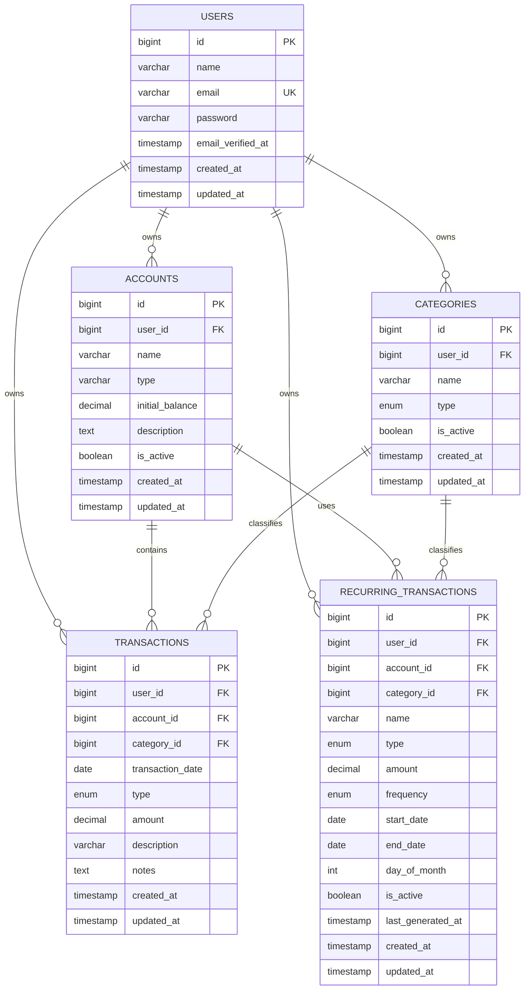
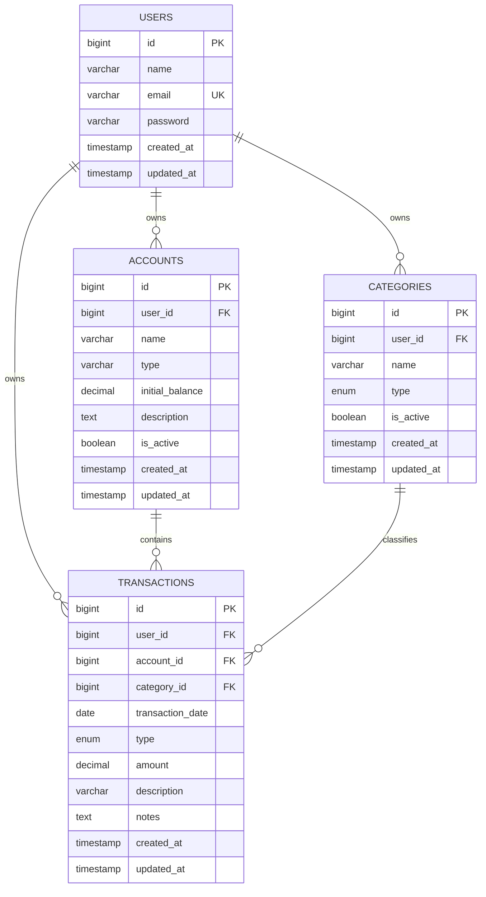

# ERD — Sistem Manajemen Keuangan Multi-User

## 1. Gambaran ERD

Sistem menggunakan konsep **multi-user**, sehingga setiap data keuangan harus memiliki pemilik (`user_id`) atau dapat ditelusuri melalui relasi ke user.

Relasi utama:

```text
USERS
  │
  ├───────────────┐
  │               │
  ▼               ▼
ACCOUNTS       CATEGORIES
  │               │
  └───────┬───────┘
          │
          ▼
     TRANSACTIONS
```

Untuk fitur transaksi rutin:

```text
USERS
  │
  ├── ACCOUNTS
  │      │
  │      └── TRANSACTIONS
  │
  ├── CATEGORIES
  │      │
  │      └── TRANSACTIONS
  │
  └── RECURRING_TRANSACTIONS
             │
             └── menghasilkan TRANSACTIONS
```

---

# 2. Mermaid ERD

ERD berikut dapat digunakan pada editor yang mendukung **Mermaid**.



---

# 3. Penjelasan Entitas

## 3.1 Users

Menyimpan data akun pengguna sistem.

### Fields

| Field | Type | Key | Nullable | Description |
|---|---|---|---|---|
| id | BIGINT | PK | No | ID user |
| name | VARCHAR(255) | - | No | Nama pengguna |
| email | VARCHAR(255) | UNIQUE | No | Email login |
| password | VARCHAR(255) | - | No | Password terenkripsi |
| email_verified_at | TIMESTAMP | - | Yes | Waktu verifikasi email |
| created_at | TIMESTAMP | - | Yes | Waktu dibuat |
| updated_at | TIMESTAMP | - | Yes | Waktu diperbarui |

### Relasi

```text
User
├── hasMany Accounts
├── hasMany Categories
├── hasMany Transactions
└── hasMany RecurringTransactions
```

---

# 4. Accounts

Menyimpan sumber dana atau kas milik user.

Contoh:

```text
Kas Rumah
Kas Usaha
Bank
Dompet
```

### Fields

| Field | Type | Key | Nullable | Description |
|---|---|---|---|---|
| id | BIGINT | PK | No | ID account |
| user_id | BIGINT | FK | No | Pemilik account |
| name | VARCHAR(255) | - | No | Nama account |
| type | VARCHAR(50) | - | No | Jenis account |
| initial_balance | DECIMAL(15,2) | - | No | Saldo awal |
| description | TEXT | - | Yes | Keterangan |
| is_active | BOOLEAN | - | No | Status account |
| created_at | TIMESTAMP | - | Yes | Waktu dibuat |
| updated_at | TIMESTAMP | - | Yes | Waktu diperbarui |

### Foreign Key

```text
accounts.user_id
        ↓
users.id
```

### Relasi

```text
User 1 ──────── N Accounts

Account 1 ───── N Transactions
Account 1 ───── N RecurringTransactions
```

---

# 5. Categories

Menyimpan kategori pemasukan dan pengeluaran.

Contoh kategori pemasukan:

```text
Gaji
Honor
Pendapatan
Bonus
Pengembalian Uang
Lainnya
```

Contoh kategori pengeluaran:

```text
Makanan / Dapur
Transportasi
Listrik
Internet / WiFi
ATK
Belanja Rumah Tangga
Servis
Pengiriman
Honor
Konsumsi
Lainnya
```

### Fields

| Field | Type | Key | Nullable | Description |
|---|---|---|---|---|
| id | BIGINT | PK | No | ID kategori |
| user_id | BIGINT | FK | No | Pemilik kategori |
| name | VARCHAR(255) | - | No | Nama kategori |
| type | ENUM | - | No | `income` / `expense` |
| is_active | BOOLEAN | - | No | Status kategori |
| created_at | TIMESTAMP | - | Yes | Waktu dibuat |
| updated_at | TIMESTAMP | - | Yes | Waktu diperbarui |

### Foreign Key

```text
categories.user_id
        ↓
users.id
```

### Relasi

```text
User 1 ──────── N Categories

Category 1 ─── N Transactions
Category 1 ─── N RecurringTransactions
```

---

# 6. Transactions

Merupakan tabel inti sistem untuk menyimpan semua transaksi keuangan.

Satu transaksi dapat berupa:

```text
income  = uang masuk
expense = uang keluar
```

### Fields

| Field | Type | Key | Nullable | Description |
|---|---|---|---|---|
| id | BIGINT | PK | No | ID transaksi |
| user_id | BIGINT | FK | No | Pemilik transaksi |
| account_id | BIGINT | FK | No | Account sumber dana |
| category_id | BIGINT | FK | No | Kategori transaksi |
| transaction_date | DATE | - | No | Tanggal transaksi |
| type | ENUM | - | No | `income` / `expense` |
| amount | DECIMAL(15,2) | - | No | Nominal transaksi |
| description | VARCHAR(255) | - | No | Keterangan transaksi |
| notes | TEXT | - | Yes | Catatan tambahan |
| created_at | TIMESTAMP | - | Yes | Waktu dibuat |
| updated_at | TIMESTAMP | - | Yes | Waktu diperbarui |

### Foreign Key

```text
transactions.user_id
        ↓
users.id

transactions.account_id
        ↓
accounts.id

transactions.category_id
        ↓
categories.id
```

### Relasi

```text
User 1 ───────── N Transactions
Account 1 ────── N Transactions
Category 1 ────── N Transactions
```

---

# 7. Recurring Transactions

Tabel ini digunakan untuk menyimpan transaksi yang berulang.

Contoh:

```text
WiFi
Listrik
Honor
Kas Bulanan
Langganan
```

### Fields

| Field | Type | Key | Nullable | Description |
|---|---|---|---|---|
| id | BIGINT | PK | No | ID recurring transaction |
| user_id | BIGINT | FK | No | Pemilik |
| account_id | BIGINT | FK | No | Account |
| category_id | BIGINT | FK | No | Kategori |
| name | VARCHAR(255) | - | No | Nama transaksi rutin |
| type | ENUM | - | No | `income` / `expense` |
| amount | DECIMAL(15,2) | - | No | Nominal |
| frequency | ENUM | - | No | Frekuensi |
| start_date | DATE | - | No | Tanggal mulai |
| end_date | DATE | - | Yes | Tanggal berakhir |
| day_of_month | INT | - | Yes | Hari dalam bulan |
| is_active | BOOLEAN | - | No | Status aktif |
| last_generated_at | TIMESTAMP | - | Yes | Terakhir dibuat menjadi transaksi |
| created_at | TIMESTAMP | - | Yes | Waktu dibuat |
| updated_at | TIMESTAMP | - | Yes | Waktu diperbarui |

### Contoh Frequency

```text
daily
weekly
monthly
yearly
```

### Foreign Key

```text
recurring_transactions.user_id
        ↓
users.id

recurring_transactions.account_id
        ↓
accounts.id

recurring_transactions.category_id
        ↓
categories.id
```

---

# 8. Relasi Antar Tabel

## Users → Accounts

```text
1 User
   │
   ├── Account 1
   ├── Account 2
   └── Account N
```

Cardinality:

```text
USERS 1 : N ACCOUNTS
```

---

## Users → Categories

```text
1 User
   │
   ├── Category 1
   ├── Category 2
   └── Category N
```

Cardinality:

```text
USERS 1 : N CATEGORIES
```

---

## Users → Transactions

```text
1 User
   │
   ├── Transaction 1
   ├── Transaction 2
   └── Transaction N
```

Cardinality:

```text
USERS 1 : N TRANSACTIONS
```

---

## Accounts → Transactions

```text
1 Account
   │
   ├── Transaction 1
   ├── Transaction 2
   └── Transaction N
```

Cardinality:

```text
ACCOUNTS 1 : N TRANSACTIONS
```

---

## Categories → Transactions

```text
1 Category
   │
   ├── Transaction 1
   ├── Transaction 2
   └── Transaction N
```

Cardinality:

```text
CATEGORIES 1 : N TRANSACTIONS
```

---

# 9. Data Isolation Multi-User

Data isolation merupakan aturan paling penting dalam ERD ini.

Contoh:

```text
USER A
│
├── Account A
├── Category A
└── Transaction A

USER B
│
├── Account B
├── Category B
└── Transaction B
```

User A tidak boleh mengakses:

```text
Account B
Category B
Transaction B
Recurring Transaction B
```

Walaupun User A mengetahui ID data tersebut.

---

# 10. Aturan Foreign Key

Rekomendasi constraint:

```text
accounts.user_id
    → users.id
    ON DELETE CASCADE

categories.user_id
    → users.id
    ON DELETE CASCADE

transactions.user_id
    → users.id
    ON DELETE CASCADE

transactions.account_id
    → accounts.id
    ON DELETE RESTRICT

transactions.category_id
    → categories.id
    ON DELETE RESTRICT

recurring_transactions.user_id
    → users.id
    ON DELETE CASCADE

recurring_transactions.account_id
    → accounts.id
    ON DELETE RESTRICT

recurring_transactions.category_id
    → categories.id
    ON DELETE RESTRICT
```

### Catatan

`ON DELETE RESTRICT` pada Account dan Category disarankan agar data yang sudah digunakan oleh transaksi tidak dapat dihapus secara sembarangan.

Jika user ingin menghilangkan kategori/account, lebih aman menggunakan:

```text
is_active = false
```

daripada menghapus data secara permanen.

---

# 11. Aturan Type Transaksi

Field:

```text
transactions.type
```

memiliki dua nilai:

```text
income
expense
```

### Income

Menambah saldo:

```text
Saldo + amount
```

### Expense

Mengurangi saldo:

```text
Saldo - amount
```

Contoh:

```text
Saldo Awal = Rp2.000.000

Income = Rp500.000

Saldo = Rp2.500.000
```

Kemudian:

```text
Expense = Rp150.000

Saldo = Rp2.350.000
```

---

# 12. Perhitungan Saldo

Saldo tidak perlu disimpan sebagai nilai yang diinput manual pada setiap transaksi.

Rumus:

```text
Saldo Account =
initial_balance
+ SUM(income)
- SUM(expense)
```

Contoh:

```text
Initial Balance
Rp2.000.000

Income
Rp1.000.000

Expense
Rp350.000

Saldo:
Rp2.650.000
```

### Catatan Penting

Jangan membuat field:

```text
balance
```

di tabel `transactions` hanya untuk menyimpan saldo berjalan jika belum ada kebutuhan khusus.

Saldo dapat dihitung dari:

```text
accounts.initial_balance
+
transactions
```

Pendekatan ini menghindari inkonsistensi ketika transaksi lama diedit atau dihapus.

---

# 13. Validasi Konsistensi User

Walaupun `transactions` mempunyai `user_id`, sistem tetap harus memastikan:

```text
transaction.user_id
=
account.user_id
=
category.user_id
=
auth()->id()
```

Contoh transaksi valid:

```text
User A
   │
   ├── Account A
   ├── Category A
   └── Transaction A
```

Contoh transaksi tidak valid:

```text
User A
   │
   ├── Account A
   ├── Category B  ❌
   └── Transaction A
```

Sistem harus menolak transaksi tersebut.

---

# 14. Index Database

Untuk performa, beberapa field sebaiknya diberi index.

### Accounts

```text
INDEX user_id
```

### Categories

```text
INDEX user_id
INDEX user_id, type
```

### Transactions

```text
INDEX user_id
INDEX account_id
INDEX category_id
INDEX transaction_date
INDEX user_id, transaction_date
INDEX user_id, type
```

### Recurring Transactions

```text
INDEX user_id
INDEX account_id
INDEX category_id
INDEX is_active
```

---

# 15. Unique Constraint

Kategori sebaiknya tidak boleh memiliki nama yang sama dalam satu user untuk jenis yang sama.

Contoh:

```text
User A
expense + ATK
expense + ATK  ❌ duplicate
```

Tetapi:

```text
User A
income + Honor
expense + Honor
```

dapat diperbolehkan karena tipenya berbeda.

Rekomendasi:

```text
UNIQUE(user_id, name, type)
```

Untuk account, dapat menggunakan:

```text
UNIQUE(user_id, name)
```

sehingga satu user tidak memiliki dua account dengan nama yang sama.

---

# 16. Index dan Constraint Ringkasan

```text
USERS
├── PK: id
└── UNIQUE: email

ACCOUNTS
├── PK: id
├── FK: user_id
├── INDEX: user_id
└── UNIQUE: user_id + name

CATEGORIES
├── PK: id
├── FK: user_id
├── INDEX: user_id
└── UNIQUE: user_id + name + type

TRANSACTIONS
├── PK: id
├── FK: user_id
├── FK: account_id
├── FK: category_id
├── INDEX: user_id
├── INDEX: account_id
├── INDEX: category_id
└── INDEX: transaction_date

RECURRING_TRANSACTIONS
├── PK: id
├── FK: user_id
├── FK: account_id
├── FK: category_id
├── INDEX: user_id
└── INDEX: is_active
```

---

# 17. Model Laravel

Jika menggunakan Laravel Eloquent, struktur model:

```text
User
├── hasMany(Account)
├── hasMany(Category)
├── hasMany(Transaction)
└── hasMany(RecurringTransaction)

Account
├── belongsTo(User)
├── hasMany(Transaction)
└── hasMany(RecurringTransaction)

Category
├── belongsTo(User)
├── hasMany(Transaction)
└── hasMany(RecurringTransaction)

Transaction
├── belongsTo(User)
├── belongsTo(Account)
└── belongsTo(Category)

RecurringTransaction
├── belongsTo(User)
├── belongsTo(Account)
└── belongsTo(Category)
```

---

# 18. MVP vs Future ERD

Untuk **MVP pertama**, sebenarnya `recurring_transactions` belum wajib.

ERD minimal:

```text
users
  │
  ├── accounts
  │
  ├── categories
  │
  └── transactions
```

Setelah sistem inti stabil, tambahkan:

```text
recurring_transactions
```

Hal ini membuat pengembangan lebih sederhana dan mengurangi kompleksitas pada tahap awal.

---

# 19. ERD MVP



---

# 20. Rekomendasi Final

Untuk implementasi awal Laravel, gunakan **4 tabel inti**:

```text
users
accounts
categories
transactions
```

Kemudian pada tahap berikutnya:

```text
recurring_transactions
```

ditambahkan ketika fitur transaksi rutin mulai dikembangkan.

Struktur ini sudah cukup untuk menangani:

- Multi-user.
- Data isolation.
- Multiple account.
- Kategori pemasukan/pengeluaran.
- Pencatatan transaksi.
- Perhitungan saldo.
- Dashboard.
- Laporan.
- Filter transaksi.
- Export PDF.
- Export Excel.
- Pengembangan transaksi rutin di masa depan.
